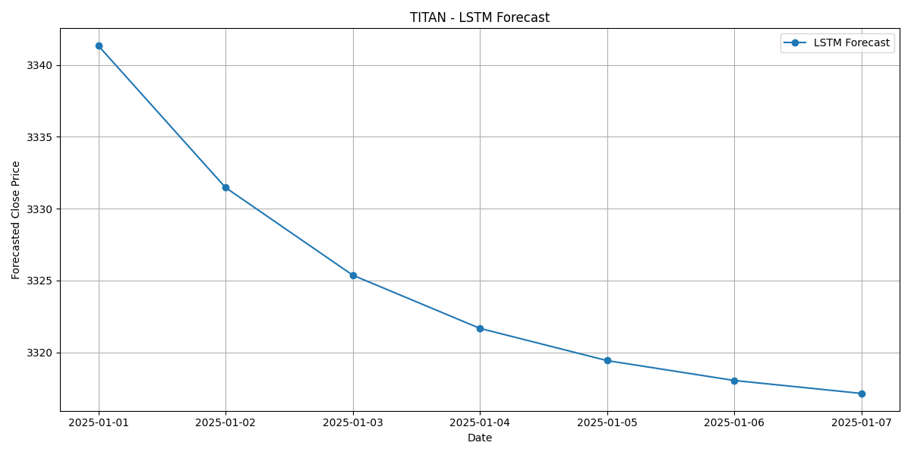

# 📈 Stock Price Predictor App (with LSTM, ElasticNet, and more)

Welcome to my machine learning-powered stock prediction app! This project was built as a learning journey in Quant Finance and AI, with guidance from ChatGPT. It's designed to be beginner-friendly and shows how real-world stock data can be used to make short-term forecasts using both classical and deep learning models.

---

## 🚀 What This App Does

- Downloads stock data for any NSE-listed company using Yahoo Finance
- Engineers technical indicators like moving averages, RSI, MACD, and volatility
- Trains **7 different ML models** including:
  - Linear Regression
  - Ridge, Lasso, ElasticNet
  - Support Vector Regressor
  - Random Forest
  - XGBoost
- Runs **LSTM** (deep learning) model for time-based prediction
- Performs **multi-step forecasting**
- Presents the results in a simple **Gradio web interface**

---

## 🧠 Why This Project Exists

I wanted to understand:
- How do financial forecasts work?
- Can machine learning really predict stock prices?
- How to combine real-world data with ML, without being an expert?

This project started from scratch and was built piece-by-piece using Python and ChatGPT's mentorship.

---

## 🖥️ Live App Demo

> 📍 Run locally:
```bash
python app.py
```

> 🔍 You will see a URL like `http://127.0.0.1:7860` — open it in your browser!

---

## ✨ Features

| Feature                        | Description |
|-------------------------------|-------------|
| 📉 ML Forecasting             | Traditional models like ElasticNet & SVR |
| 🔮 LSTM Forecast              | Deep learning model trained on sequences |
| 📊 Model Evaluation           | RMSE, R², residual plots |
| 🔁 Multi-step Forecasting     | Predicts several future days at once |
| 📋 CSV & Plot Output          | Forecasts saved for further use |
| 🧩 Modular Code               | Easy to extend or switch models |
| 🧑‍💻 Beginner Friendly         | Clear file structure and walkthrough |

---

## 📂 Project Structure

```
stock-predictor-ml/
│
├── app.py                  # Gradio interface
├── run_pipeline.py         # Main orchestrator
├── src/
│   ├── data_loader.py      # Fetches stock data
│   ├── feature_engineering.py
│   ├── eda.py              # Exploratory Data Analysis
│   ├── evaluate_models.py  # Evaluations metrics
│   ├── train_models.py     # Trains ML models
│   ├── lstm_model.py       # Builds LSTM model
│   ├── forecast.py         # Forecasting logic
├── data/                   # Processed data
├── models/                 # Saved model files
├── reports/                # Plots and forecast CSVs
└── requirements.txt        # Python libraries
```

---

## 🔧 How to Run It (Step-by-Step)

1. **Clone the repo**
```bash
git clone https://github.com/prasad14082000/stock-predictor-ml.git
cd stock-predictor-ml
```

2. **Set up environment**
```bash
pip install -r requirements.txt
```

3. **Run the app**
```bash
python unified_app.py
```

4. **Enter your inputs** in the Gradio web UI — like:
   - Stock symbol: `TITAN`
   - Start date: `2020-01-01`
   - End date: `2025-01-01`
   - Forecast days: `7`

---

## 🧪 Sample Forecast Output



> You also get a CSV file with predicted values for each day.

---

## 💡 What I Learned

- Feature engineering is **half the work** in ML.
- Classical models are not obsolete — they’re still powerful and interpretable.
- Gradio makes it **super easy** to deploy ML models.
- Don’t be afraid to build even if you don’t know everything upfront — just start!

---

## 📚 Acknowledgements

- Thanks to [OpenAI's ChatGPT](https://openai.com/chatgpt) for mentoring me through this journey.
- Inspired by projects in Quant Finance and practical ML.

---

## 📬 Contact

Feel free to reach out if you’re also a beginner or want to collaborate:

- 📧 prasadsonsale10@gmail.com

- 📊 LinkedIn: [Prasad Sonsale](https://linkedin.com/in/prasad-sonsale)

---

## 🌟 Star This Repo

If you found this project useful, please consider giving it a ⭐ on GitHub — it motivates me to keep learning and building more!

---
🕓 Last updated: 2025-06-25
